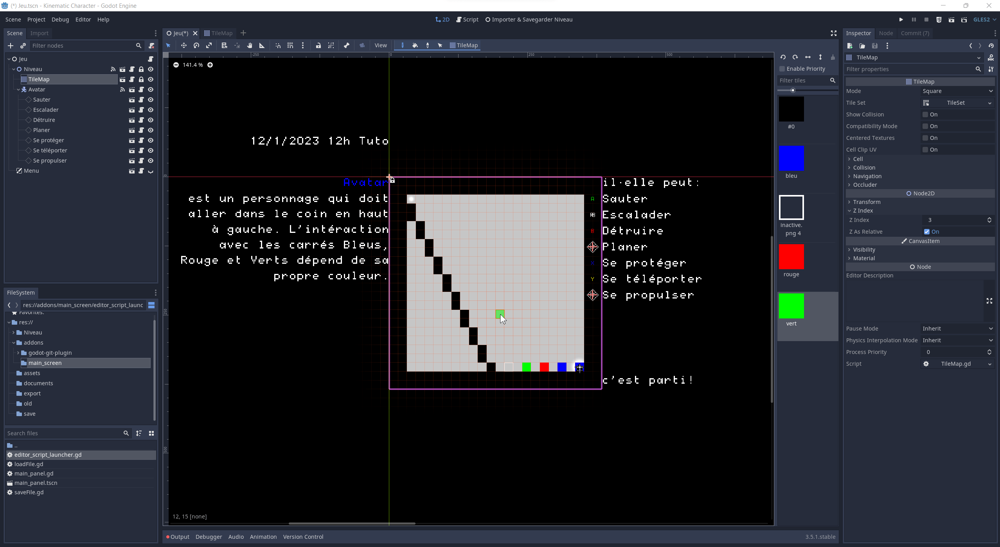

# Kinématique

*testé avec Godot 3.5.2*

Boite à outils pour prototyper un jeu-vidéo de plateforme en 2D dans l’interface du moteur de jeu-vidéo [Godot](https://godotengine.org/download/).

Il se concentre sur des notions de *game design* et surtout de *level design* en éloignant — peut-être dans un premier temps — le code pour cell·eux qui souhaitent l’utiliser ou encadrer des ateliers et cours.
Comme tout à lieu dans l’interface d’un véritable éditeur de jeu-vidéo, tout est augmentable, paramétrable et reprogrammable.

Testez [ici](https://brulé.net/kinématique/) les niveaux créés dans des ateliers (groupes d'environs 5 enfants de 6 à 12 ans) !

Beaucoup de choix qui structurent le projet sont fait pour faciliter la manipulation lors d’un atelier par une personne qui ne connaît pas forcément Godot et ne sait pas coder. La structuration de l’arborescence des nœuds du projet permet de rendre visible dans la scene principale `Jeu.tscn` seulement les nœuds intéressants et faciles à modifier pour se concentrer sur le level design et les bases du game design.

Un wiki permet d’explorer [l’installation](https://github.com/CorentinBrule/kinematic/wiki/1.-Installation) et [la prise en main](https://github.com/CorentinBrule/kinematic/wiki/2.-Prise-en-main) ; les [ressources pédagogiques (déroulement d’ateliers)](https://github.com/CorentinBrule/kinematic/wiki/Ressources-p%C3%A9dagogiques) et les [aspects techniques pour adapter l’outil en mettant les mains dans le cambouis](https://github.com/CorentinBrule/kinematic/wiki/Aller-plus-loin-(dev)).

## Principe générale du jeu

*Kinématique* permet de prototyper un niveau de jeu de plateforme en 2D. Il met en place donc un certains nombre de principe de base de *gameplay*:

- on contrôle un **objet / personnage / avatar**
- l’**avatar** est soumis à des règles qui ressemblent à la gravité (attiré par le bas, retenu par d’autres objets physiques)
- il se déplace et interagit avec l’environnement grâce à des **capacités / équipements / items**
- le joueur ou la joueuse doit atteindre une zone pour completer le niveau
- l’environnement se construit sur une grille de 20 carrés par 20 (400 carrés)
- l’**avatar** que l’on contrôle fait la taille d’un carré
- il existe une dynamique entre 3 couleurs qui forme "un jeu à somme nulle" comme le pierre/feuille/ciseaux ou le poule/renard/viper :

    - le **rouge** bat le **vert** mais est battu par le **bleu**
    - le **bleu** bat le **rouge** mais est battu par le **vert**
    - le **vert** bat le **bleu** mais est battu par le **rouge**
  
> pour l’expliquer autrement : ces couleurs viennent de la dynamique des trois éléments principaux des jeu Pokémon **feu / eau / plante** : Salamèche, Carapuce, Bulbizar.... tmtc.

**Ainsi, la couleur de l’avatar détermine ce qui est négatif pour lui (ennemies, malus, pièges...) et ce qui est positif (alliés, bonus, nourriture...)**

- sans interaction particulière ou modification des règles du jeu, l’avatar qui touche un carré de la couleur malus, disparaît et réapparaît au point de départ ("perds"/"meurs"), laissant une petite croix pour que l’on se rappel là où l’on a raté.

- les éléments de couleur **noir** sont neutres (**plateforme**)
- les carrés aux **contours blancs** sont des checkpoints

Certaines de ces règles peuvent être ignorées ou pourront être adaptées selon les besoins de l’atelier.

## Crédits

Merci à Marine Bourlet-Simon pour son apport à la dimension pédagogique du projet

[Licence Art Libre 1.3](https://artlibre.org/) + [CC BY-SA 4.0](https://creativecommons.org/licenses/by-sa/4.0/legalcode)

* [FT88 Regular font](https://velvetyne.fr/fonts/degheest/) by Ange Degheest + Oriane Charvieux + Mandy Elbé : [SIL Open Font License 1.1](http://scripts.sil.org/cms/scripts/page.php?site_id=nrsi&id=OFL)

* Code et assets de [Godot](https://github.com/godotengine/godot/blob/master/LICENSE.txt) et de [2D Kinematic Character Demo](https://github.com/godotengine/godot-demo-projects/blob/master/LICENSE.md) : MIT Licence.

Merci à toute la communauté de Godot !